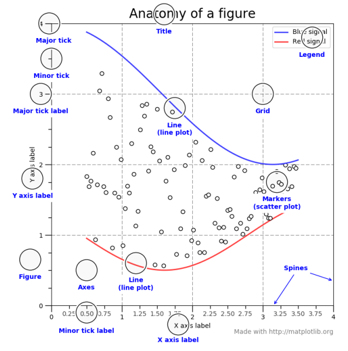
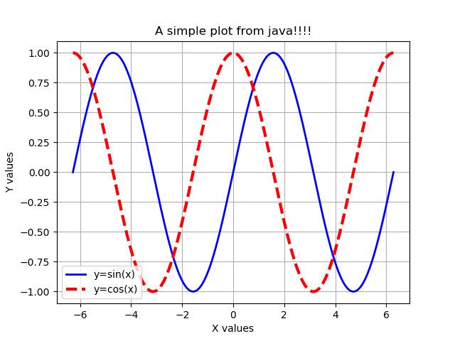
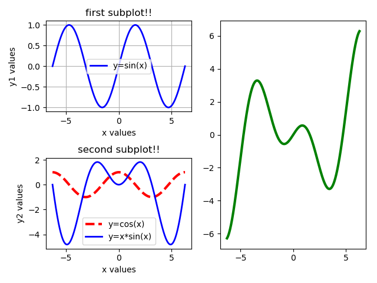
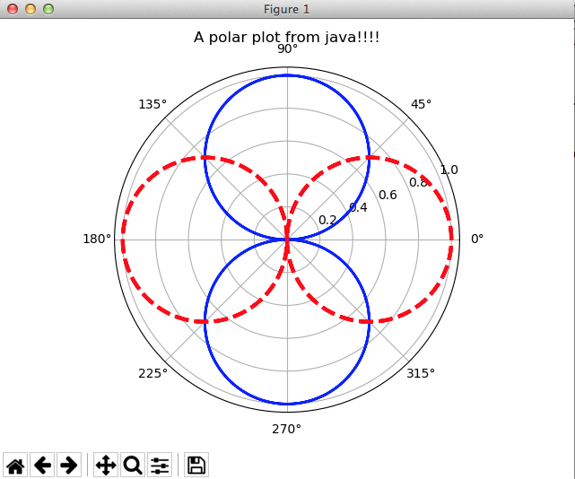
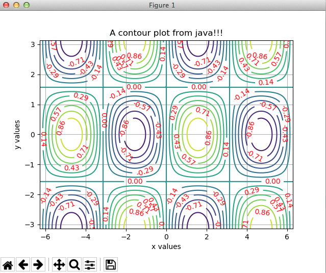

# pyplot4j
A nice and easy-to-use __static__ java wrapper for matplotlib.pyplot

**Static** means the generated plot window runs on a _python_ process, hence it cannot be dynamically included in a Java GUI such as JPanel or JFrame.

## Introduction

The plotting library of _matplotlib_ is one the most powerful and easy to use libraries ever created.
Although it is possible to implement a similar library purely in java, it also makes sense to simply use the capabilities of the *matplotlib*.
To this end, this repository aims at providing a java framework that can easily generate the _python_ code necessary for drawing the plots.
After the python code is generated, the framework will execute a terminal (commandline) command **"python file_name.py"** and a window will open with the drawn plots.

The original documentation of **matplotlib** can be found here: [Matplotlib Documentation](https://matplotlib.org/Matplotlib.pdf)

REQUIREMENTS: this framework requires the installation of _python 2_ or _python 3_ and the _matplotlib_ and _numpy_ packages.

## Current Capabilities
* XYPlot
   * this is similar to executing _plt.plot(x, y, *args, **kwargs)_ in python. XYPlot resembles a _Figure_ object in _matplotlib_.
* XYSubPlot
   * this is similar to executing _plt.subplot(row, column, index)_ first and then _plt.plot(x, y, *args, **kwargs)_ in _matplotlib_.
* PolarPlot
   * this is similar to executing a plot with _projection='polar'_ keyword argument.
* ContourPlot
   * this is similar to executing _plt.contour(X, Y, Z, labels=[])_. The contour labels can be set in a similar way to _plt.clabel(**kwargs)_.
   An interface called "MeshGrid.java" is provided to generate the Z data points.
   ```java
   public interface MeshGrid {
	double value(double x, double y) ;
	}
   ```
* ContourSubPlot
   * this is similar to having multiple subplots each one drawing contour plots.

## Visual Guide to Matplotlib



## XYPlot
As the name suggests, this provides a simple API to draw plots in XY cartesian coordinates.
The step-by-step guide is as follows (see __Example1.java__):

* Step 0: create some data. Let's plot y=sin(x) and y=cos(x) over the [-2pi, 2pi] interval.
```java
// step 0
double[] x = MathUtils.linspace(-2.0*Math.PI, 2.0*Math.PI, 1000) ;
double[] y1 = Arrays.stream(x).map(Math::sin).toArray() ;
double[] y2 = Arrays.stream(x).map(Math::cos).toArray() ;
```

* Step 1: create an XYPlot instance and plot the first curve y=sin(x). The java code is based on the builder design pattern which means it is possible to change multiple commands one after another.
The "plot()" method returns an XYSeries object which is used to set properties such as "marker", "color", "linestyle", etc.
```java
// step 1
XYPlot plt = new XYPlot("A simple plot from java!!!!") ;
plt.plot(x, y1).color("b").linestyle("-").linewidth(2.0).label("y=sin(x)") ;
```

* Step 2: now plot the second curve y=cos(x) by invoking the "plot()" method on the same XYPlot. This returns a __new__ XYSeries which can be configured for this curve.
```java
// step 2
plt.plot(x, y2).color("r").linestyle("--").linewidth(2.0).label("y=cos(x)") ;
```

* Step 3: now that we're done with the curves, let's configure the plot itself. Let's add xlabel and ylabel, make the legend and grids visible, also ask the plot to use _tight_layout()_ to automatically calculate the best dimesions.
```java
// step 3
plt.xlabel("X values").ylabel("Y values").legend(true).grid(true) ;
plt.tightLayout() ;
```

* Step 4: finally, we can either "show()" the plot or save it a file "savefig(file_name)".
```java
// step 4
plt.show();
```

Here's the result:




## XYSubPlot
Simplar steps can be taken to create subplots of multiple figures. See __Example2.java__ for more details.

Here's an example:
```java
// step 0
double[] x = MathUtils.linspace(-2.0*Math.PI, 2.0*Math.PI, 1000) ;
double[] y1 = Arrays.stream(x).map(Math::sin).toArray() ;
double[] y2 = Arrays.stream(x).map(Math::cos).toArray() ;
double[] y3 = Arrays.stream(x).map(t -> t*Math.sin(t)).toArray() ;
double[] y4 = Arrays.stream(x).map(t -> t*Math.cos(t)).toArray() ;
// step 1
XYSubPlot plt = new XYSubPlot() ;
plt.subplot(2, 2, 1).grid(true).xlabel("x values").ylabel("y1 values").title("first subplot!!")
   .legend(true)
   .plot(x, y1).color("b").linestyle("-").linewidth(2.0).label("y=sin(x)") ;
// step 2
XYPlot subplot = plt.subplot(2, 2, 3).grid(false).xlabel("x values").ylabel("y2 values").title("second subplot!!").legend(true) ;
subplot.plot(x, y2).color("r").linestyle("--").linewidth(3.0).label("y=cos(x)") ;
subplot.plot(x, y3).color("b").linestyle("-").linewidth(2.0).label("y=x*sin(x)") ;
// step 3
plt.subplot(1, 2, 2).plot(x, y4).color("g").linestyle("-").linewidth(3.0).label("y=x*cos(x)") ;
// step 4
plt.tightLayout() ;
plt.show();
```



## PolarPlot
This plot is very similar to XYPlot, except it uses _plt.subplot(1, 1, 1, polar=True)_ command to generate a polar plot.
Note that the order of parameters is _theta_ and _r_.

See **Exampe3.java** for more info.

```java
// step 0
double[] theta = MathUtils.linspace(-2.0*Math.PI, 2.0*Math.PI, 1000) ;
double[] r1 = Arrays.stream(theta).map(t -> abs(sin(t))).toArray() ;
double[] r2 = Arrays.stream(theta).map(t -> abs(cos(t))).toArray() ;
// step 1
PolarPlot plt = new PolarPlot("A polar plot from java!!!!") ;
plt.plot(theta, r1).color("b").linestyle("-").linewidth(2.0).label("y=sin(x)") ;
// step 2
plt.plot(theta, r2).color("r").linestyle("--").linewidth(3.0).label("y=cos(x)") ;
// step 3
plt.tightLayout() ;
// step 4
plt.show();
```

Here's the result:



## ContourPlot
The contour plot can draw contours (unfilled or filled) of a two-dimensional function using _plt.contour(X,Y,Z)_ or _plt.contourf(X,Y,Z)_. The contour levels can be set automatically, or passing them as a parameter, or by clicking on the drawn contours (_manual mode_).
Let's plot the contours z=sin(x)cos(y) over the [-2pi,2pi]x[-pi,pi] region.

* Step 1: create the x, y data.

```java
// step 1
double[] x = MathUtils.linspace(-2.0*PI, 2.0*PI, 200) ;
double[] y = MathUtils.linspace(-PI, PI, 100) ;
```

* Step 2: create z data using _MeshGrid_ interface.
   * Note that we don't need to calculate the z values. We just pass the meshgrid function to the plot.

```java
// step 2
MeshGrid grid = (xi, yj) -> sin(xi)*cos(yj) ;
```

* Step 3: create the contour plot and specify the contour levels

```java
// step 3
ContourPlot plt = new ContourPlot("A contour plot from java!!!") ;
plt.contour(x, y, grid)
   .clabel().levels(MathUtils.linspace(-1.0, 1.0, 15))
   .color("r").fmt("%.2f");
```

* Step 4: add xlabel, ylabel and turn the grid on.

```java
// step 4
plt.xlabel("x values").ylabel("y values").grid(true, "major", "both") ;
```

* Step 5: finally, show the plot or save it to a file.

```java
// step 5
plt.show();
```

Here's the result:




